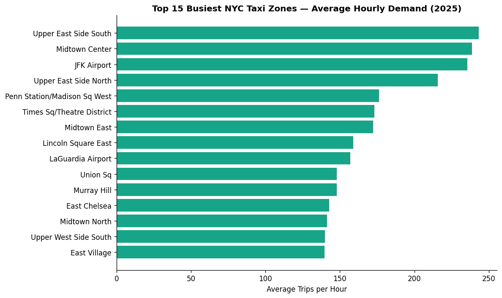
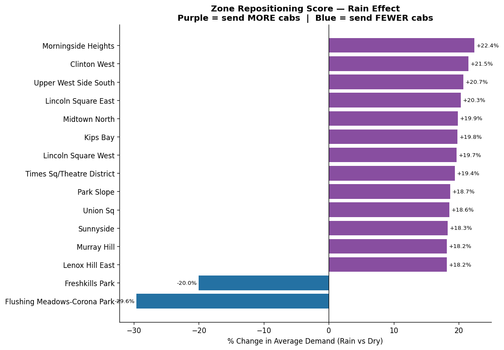
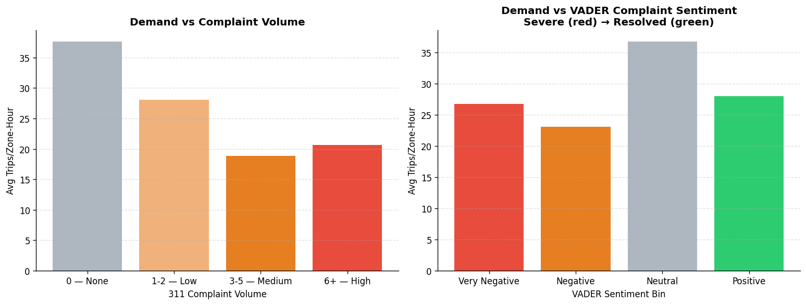
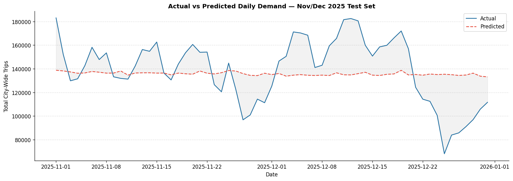

# NYC Yellow Taxi Fleet Positioning System


## Executive Summary

**The Problem:** NYC Yellow Taxi fleet managers must constantly decide where to reposition idle cabs across 263 zones in real time. Standard demand forecasts only tell managers where demand already is, not where it's *heading*, and not which zones need cabs *right now* based on live conditions.

**The Solution:** We built a complete end-to-end fleet positioning system that integrates five public NYC data sources (taxi trip records, weather, special event permits, 311 complaint data, and zone geographies) to produce actionable repositioning scores by zone. A Random Forest model forecasts demand at the zone-hour level, and a Groq LLM (Llama 3.1) synthesises quantitative findings into plain-language repositioning decisions for fleet managers.

**Key Impact:**
* **R² of 0.868** on a held-out Nov-Dec 2025 test set, capturing holiday and event-driven demand spikes
* **60.2% RMSE reduction** from naive baseline to M1 (zone + time alone), confirming structural predictability of taxi demand
* **+22% rain demand lift** in Midtown Manhattan zones; negative lift at airports, a directly actionable repositioning signal
* **4.9x event demand lift** in active-event zones, enabling pre-positioning before major city events end
* **1,430,274 zone-hour records** integrated across 5 data sources with 100% geocoding success rate

---

## EDA: Four Actionable Signals

### Demand by Zone



Upper East Side and Midtown dominate hourly demand. Airports rank high in volume but behave differently under weather and event conditions.

### Rain Repositioning Signal



Rain creates a clear split: Manhattan residential and commercial zones gain 18-22% demand; park zones lose up to 30%. This divergence is the key repositioning signal.

### 311 Complaint Sentiment vs Demand



Zones with high complaint volume and very negative sentiment see 50% lower demand than neutral zones. Complaint data adds a real-time friction signal the taxi trip records alone can't capture.

---

## Model Performance

We built four incremental models to quantify the value of each external data source:

| Model | Features | RMSE | R² | RMSE vs Baseline |
|-------|----------|------|-----|-----------------|
| Baseline | Training mean | 75.2 | -- | -- |
| M1 | Zone + time features | 27.11 | 0.868 | -64% |
| M2 | M1 + weather | 27.05 | 0.869 | -64.1% |
| M3 | M2 + events | 27.00 | 0.870 | -64.1% |
| M4 | M3 + 311 complaints | 27.10 | 0.868 | -64.0% |

**Key takeaway:** Zone identity and time of day explain the vast majority of demand variance. Weather and event data add genuine signal but modest aggregate RMSE improvements. The value of external data shows most clearly in the directional repositioning scores (see below), not in overall accuracy.

### Actual vs Predicted Demand (Nov-Dec 2025 Test Set)



The model tracks the overall demand level well. The largest gaps occur around Thanksgiving (late November) and Christmas week — extreme holiday patterns not fully captured in training data.

---

## EDA: Repositioning Table

| Signal | Key Finding | Repositioning Action |
|--------|------------|---------------------|
| Time of day | Peak at 18:00 (56.8 trips/zone); trough at 05:00 (6.9) | Pre-position before 17:00 rush |
| Rain | Airports lose riders; Midtown gains up to +22% | Shift cabs from JFK/LGA to Midtown at first rain |
| Events | +393% demand lift in active-event zones | Pre-position 1 hr before event end time |
| 311 sentiment | Very negative zones see 50% lower demand than neutral zones | Monitor real-time sentiment; avoid high-friction zones |

---

## Technical Pipeline

### 1. Data Sources (5 integrated)
- **NYC TLC Taxi Trip Records:** 1.43M zone-hour records, Oct-Dec 2025
- **NOAA Weather Data:** Hourly precipitation and conditions, NYC stations
- **NYC Special Event Permits:** 2025 permitted events with geocoding
- **NYC 311 Complaint Data:** VADER sentiment analysis on complaint descriptions
- **NYC Taxi Zone Geographies:** Shapefiles for spatial joins (GeoPandas)

### 2. Feature Engineering
- Zone-hour demand aggregation from raw trip records
- Spatial join of 311 complaints and event permits to taxi zones via GeoPandas
- VADER sentiment scoring on complaint free-text fields
- Hour-of-day, day-of-week, and holiday flags

### 3. Modeling
- Random Forest regression at the zone-hour level
- Incremental model builds (M1 through M4) to isolate each data source's contribution
- Train on Oct 2025, test on Nov-Dec 2025 (held-out holiday period)

### 4. LLM Repositioning Layer
- Groq API (Llama 3.1) synthesises zone-level scores into plain-language repositioning decisions
- Fleet managers receive actionable recommendations without needing to interpret raw model outputs

---

## Real-World Applications

- **Fleet operators (taxi, rideshare):** Zone-level repositioning scores tell drivers where to wait before demand peaks, not after.
- **City transit planning:** Event and weather overlays identify when public transport alternatives are most needed.
- **Airport ground transportation:** The negative rain lift at airports is a direct signal to reduce cab staging during rain events.

---

## Limitations

- **R² gap on holidays:** The Nov-Dec test period includes Thanksgiving and Christmas, which are structurally different from training data. A production model would need holiday-specific features or separate models.
- **Groq API dependency:** The LLM layer requires an API key and live inference. The repositioning scores themselves are fully offline.
- **Static zone boundaries:** NYC taxi zones change over time. Geographies are pinned to 2025 shapefiles.
- **No real-time pipeline:** This is a batch forecasting system. Real-time use would require streaming trip data and live API calls.

---

## How to Run This Project

1. **Clone the repository:**
```bash
git clone https://github.com/kunalrc33xx/nyc-taxi-fleet-positioning.git
```

2. **Install dependencies:**
```bash
pip install pandas numpy scikit-learn geopandas vaderSentiment groq
```

3. **Set your Groq API key:**
```bash
export GROQ_API_KEY=your_key_here
```

4. **Run the notebook:** Open `BUDT758J_Group10_Final_Project_Python.ipynb` in Jupyter.

5. **View the rendered notebook:** Open `BUDT758J_Group10_FinalProject.html` in any browser (no Jupyter required).

6. **Read the full report:** Download `BUDT758J_Group10_FinalReport.docx` from the repo.

---

*Project by Kunal Roy Chowdhury | University of Maryland, MSBA | BUDT758J: Enterprise Cloud Computing and Big Data*
